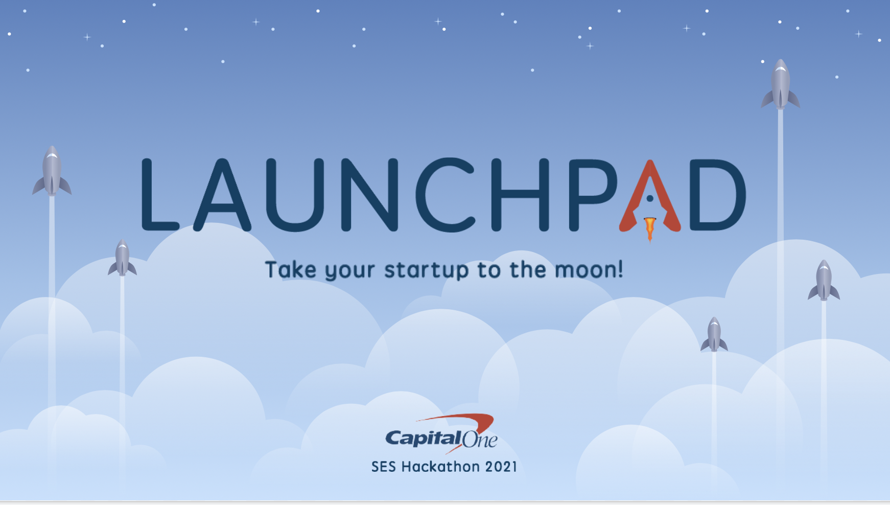

# [LaunchPad](https://launchpad-sage.vercel.app): Take your startup to the moon!
#### Made for the 2021 Capital One SES Hackathon

## Members

- [Anuva Banwasi](https://www.linkedin.com/in/anuva-banwasi-941617212/)
- [Arjav Patel](https://www.linkedin.com/in/arjavpa/)
- [Jason Cramer](https://www.linkedin.com/in/jason-cramer-617881190/)
- [Pranay Yadav](https://www.linkedin.com/in/pranayyadav/)
- [Sam Dominguez](https://www.linkedin.com/in/samueljdominguez/)

## Description

Sometimes the only thing preventing a million-dollar idea from coming to life is a lack of funding. Our web application, LaunchPad, aims to mitigate that issue by providing a simple and intuitive platform to connect investors with startups and entrepreneurs. LaunchPad offers an easy way to sign up and post your startup for investors to see. Investors can quickly search for startups based on a variety of filters and entrepreneurs can search for investors in the same way. Have a startup but also want to invest? No problem! With one account users have full access to both dashboards.

## Features
- Simple sign up process or login with a Google account
- Get recommendations of investors to contact and startups to explore!
- Filter out investors and startups by name, location, or tags
- Post about your own startup opportunity and catch the attention of potential investors

## Future Work
- Integrate bank accounts
- Implement chat feature between users
- Share investing updates on social media to gain traction

## Tech Stack
- React
  - Typescript and SCSS
  - Web app framework 
- Firebase
  - Database and Google authentication login
- Vercel
  - Website hosting

## Setup
- Click this [link](https://launchpad-sage.vercel.app)  
 **or...**  
1. Clone repository
2. Navigate to ["frontend"](https://github.com/RealJasomo/SES-Hackathon-Investors/tree/master/frontend) subfolder
3. Install npm
4. Run `npm i` command
5. Run `npm start` command
6. LaunchPad should open on its own

